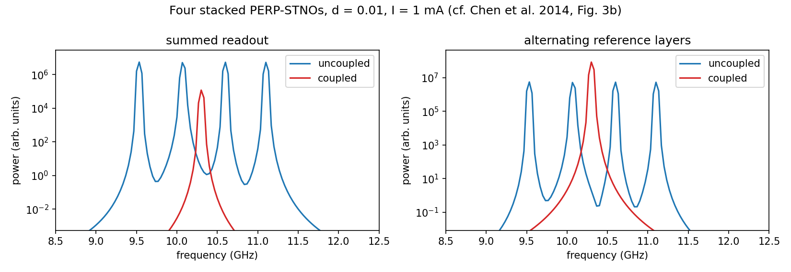

# stno-dipolar-sim

**Macrospin simulation of dipolar-coupled spin-torque nano-oscillators for neuromorphic computing**

This repository contains a validated Python/Numba simulator of arrays of spin-torque nano-oscillators (STNOs) that interact only through their magnetic dipolar stray fields. Each oscillator is described by the Landau–Lifshitz–Gilbert–Slonczewski (LLGS) equation in the macrospin approximation. The code supports per-oscillator bias currents and current polarities, AC current and AC magnetic-field inputs, thermal noise, and fabrication-induced size variations. It is the simulation basis of a project on using the collective synchronization of coupled STNOs (cluster formation, binary phase states) for oscillator-based computing such as Ising machines, Hopfield-type associative memories and reservoir computing. The included experiments validate the simulator against analytic theory and quantitatively reproduce the published results of Chen *et al.*, *J. Appl. Phys.* **115**, 134306 (2014).


*Four stacked oscillators with different natural frequencies (blue) lock to a single frequency of 10.304 GHz when dipolar coupling is switched on (red), reproducing Chen et al. (2014), who report 10.32 GHz. Left: summed readout (anti-phase order largely cancels the signal). Right: alternating reference layers restore it.*

---

## Scientific context

A **spin-torque nano-oscillator** is a nanoscale magnetic multilayer (typically 10–100 nm wide) in which a DC current, spin-polarized by a fixed magnetic layer, exerts a *spin-transfer torque* on a thin free layer. When this torque compensates magnetic damping, the free-layer magnetization precesses steadily at microwave frequencies (GHz to tens of GHz). The precession is converted into an AC voltage by magnetoresistance. STNOs are among the smallest known auto-oscillators. They are tunable by current and field, operate at room temperature, and are compatible with CMOS processing.

**Why coupled STNOs matter.** Coupled nonlinear oscillators can synchronize, either mutually locking their frequencies and phases or forming clusters. In oscillator-based (*non-Boolean*) computing, information is encoded in the relative phases of the oscillators, and the network's synchronized state is the result of the computation. Nanoscale oscillators with GHz dynamics make such hardware potentially fast and dense. Experimental demonstrations with spintronic oscillators include vowel recognition (Romera *et al.*, *Nature* 2018), reservoir computing (Torrejon *et al.*, *Nature* 2017) and phase-binarized Ising machines (Houshang *et al.*, *Phys. Rev. Appl.* 2022).

**Why dipolar coupling.** Coupling through propagating spin waves introduces distance-dependent delays, and electrical coupling requires extra circuitry. Coupling through dipolar stray fields is instantaneous and local, and its sign and strength are set by geometry. This makes it an attractive way to build oscillator networks whose connectivity is defined by layout.

This repository models **perpendicular-polarizer STNOs (PERP-STNOs)**: an in-plane magnetized Co free layer with an out-of-plane polarizer, which precesses around the film normal at a frequency set by the demagnetizing field. The default parameters are those of Chen *et al.* (2014).

---

## Repository structure

```
stno-dipolar-sim/
├── stno/                         # the simulation package
│   ├── constants.py              # physical constants, current-polarity convention
│   ├── params.py                 # device/material parameters and derived quantities
│   ├── dynamics.py               # LLGS equation, RK4 / stochastic Heun integrators, simulate()
│   ├── analysis.py               # phases, frequencies, locking metrics, spectra, linewidth
│   └── theory.py                 # analytic references (energy balance, critical currents)
├── experiments/
│   ├── 01_single_oscillator.py   # f(I) vs analytic theory, both polarities; hysteresis
│   ├── 02_chen2014_reproduction.py
│   └── 03_thermal_noise.py       # equipartition test, linewidth and phase jitter at 300 K
├── tests/test_core.py            # fast regression tests (pytest)
├── results/                      # figures and text output written by the experiments
├── requirements.txt
├── CITATION.cff
└── LICENSE
```

---

## Requirements

- **Python** ≥ 3.10 (tested with Python 3.12)
- **numpy**, **scipy**, **matplotlib**, **numba** (versions in `requirements.txt`)
- *optional:* **pytest** to run the tests

```bash
pip install -r requirements.txt
```

---

## How to run

From the repository root:

```bash
python experiments/01_single_oscillator.py        # ~1 min
python experiments/02_chen2014_reproduction.py    # ~1 min
python experiments/03_thermal_noise.py            # ~10 s
pytest -q                                         # optional, ~1 min
```

Options for every experiment:

- `--fast` runs a quick smoke test with all simulations shortened about 20×. Use it to check the installation; the numbers it produces are **not** meaningful.
- `--show` displays the figures interactively. By default they are only saved.

The first run is slower because Numba compiles the integrator and caches the result.

### Running on Kaggle or Google Colab

Run the experiments as scripts with `!python` (do not paste the files into notebook cells):

```python
!git clone https://github.com/mandanarst19/stno-dipolar-sim.git
%cd stno-dipolar-sim
!pip install -q -r requirements.txt
!python experiments/01_single_oscillator.py
!python experiments/02_chen2014_reproduction.py
!python experiments/03_thermal_noise.py
```

### Using the package directly

```python
import numpy as np
from stno import simulate, default_params, POLARITY_PARALLEL
from stno.analysis import oscillator_state

t, m = simulate(n_osc=1, current=1e-3, polarity=POLARITY_PARALLEL, duration=40e-9)
print(oscillator_state(t, m)['freq'] / 1e9, "GHz")     # ~10.07 GHz
```

`simulate()` returns the sample times `t` (s) and the magnetization trajectories `m` with shape `(n_samples, n_oscillators, 3)`.

---

## Output

Each experiment writes a figure (`.png`) and a text report (`.txt`) to `results/`. The simulations are seeded and deterministic, so you should obtain the values below (from the author's runs) to within rounding.

### 1. Single oscillator vs. analytic theory — `results/01_single_oscillator.*`

Frequency and |m_z| versus current for both current polarities, compared with the energy-balance solution, and current sweeps up and down starting from rest.

| Quantity | Theory | Simulation |
|---|---|---|
| f(I), polarity +1 | energy balance | max. error 0.8 % |
| f(I), polarity −1 | energy balance | max. error 1.3 % |
| upper critical current (+1 / −1) | 0.984 mA / 4.09 mA | precession stops there |
| onset from rest / retrapping | 0.500 mA / 0.142 mA (pendulum model) | 0.50 mA / 0.15 mA (0.05 mA steps) |

For polarity +1 the down-sweep also starts from the static state above the upper critical current and only returns to precession at about 0.85 mA, i.e. the upper boundary is hysteretic too.

### 2. Reproduction of Chen *et al.* (2014) — `results/02a_*.png`, `02b_*.png`, `02_*.txt`

Four stacked oscillators with different natural frequencies (9.53–11.10 GHz) lock to a single frequency when dipolar coupling is switched on, with anti-phase order between neighbours.

| Quantity | Chen *et al.* 2014 | This code |
|---|---|---|
| Locked frequency | 10.32 GHz | **10.304 GHz** (0.16 % difference) |
| Neighbour order | anti-phase | ⟨cos Δφ⟩ ≈ −0.99 |
| Readout coherence, summed / alternating reference layers | signal enhanced with alternating layers | 0.04 / 0.99 |
| Frequency spread f₄ − f₁ (uncoupled) at ~2 mA / ~3 mA | ≈ 2.4 / 3.0 GHz (Fig. 4) | 2.47 / 3.04 GHz |

The summed readout of an anti-phase stack almost cancels. Alternating the orientation of the reference layers, as proposed by Chen *et al.*, restores the full signal.

### 3. Thermal noise — `results/03_thermal_noise.*`

| Quantity | Expected | This code |
|---|---|---|
| Equipartition ⟨m_y²⟩ and ⟨m_z²⟩, ratio sim/theory | 1 | ≈ 0.95 / 0.96 |
| Linewidth of one oscillator, 1 mA, 300 K | — | ≈ 0.9 GHz |
| Phase jitter of a locked stacked pair, 300 K | ~0.1 rad (Chen App. E estimate) | ≈ 0.2 rad, pair remains locked |

---

## Conventions

- All quantities are in SI units. The equation of motion and the field terms are documented at the top of `stno/dynamics.py`.
- **Current polarity** (`stno/constants.py`): `+1` pushes the free layer antiparallel to the polarizer (electrons flow free layer → polarizer); `−1` pushes it parallel (electrons flow polarizer → free layer). The latter is the branch simulated by Chen *et al.* Both give self-oscillations, at different frequencies.
- The default **elliptical cross-section** (60 × 70 nm) reproduces the spin-torque strength reported by Chen *et al.* (u′ = 0.0354 at 1 mA).

## Limitations

- **Macrospin approximation.** A 60 × 70 nm free layer is at the edge of the range where the magnetization stays quasi-uniform. Quantitative results should be checked with micromagnetic simulations.
- **Point-dipole coupling.** At the shortest spacings it overestimates the coupling by up to ~1.7×. A finite-disk correction is available (`disk_correction=True`).
- These are simulations only; no experimental data are included.

## References

1. H.-H. Chen *et al.*, *J. Appl. Phys.* **115**, 134306 (2014): dipolar synchronization of PERP-STNOs.
2. J. C. Slonczewski, *J. Magn. Magn. Mater.* **159**, L1 (1996): spin-transfer torque.
3. Y. Zhou, PhD thesis, KTH Royal Institute of Technology (2009): STNO modelling and conventions.
4. T. Taniguchi and H. Kubota, *Phys. Rev. B* **93**, 174401 (2016): self-oscillation conditions of PERP-STNOs.
5. A. N. Slavin and V. S. Tiberkevich, *Phys. Rev. B* **74**, 104401 (2006): mutual phase locking of STNOs.
6. N. Locatelli *et al.*, *Sci. Rep.* **5**, 17039 (2015): dipolar synchronization of vortex STNOs.
7. B. Popescu *et al.*, *J. Appl. Phys.* **124**, 152128 (2018): STNO-based pattern recognition.

---

## Author

**Mandana Roosta**
M.Sc. in Condensed Matter Physics, Shahid Beheshti University, Tehran, Iran.
R&D / AI Engineer, Jahesh-AI, Tehran, Iran.
Research carried out in collaboration with **Dr. Seyed Majid Mohseni** (Shahid Beheshti University).

Contact: mandanaroosta.academia@gmail.com

## License

MIT License (see `LICENSE`). If you use this code, please cite it (see `CITATION.cff`).
